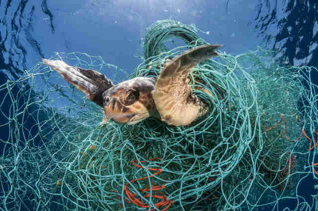
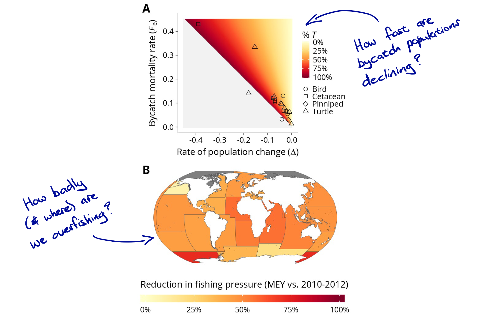
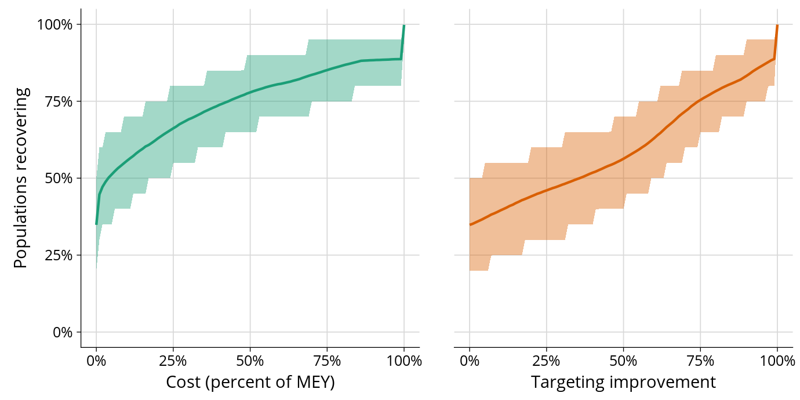

```{r setup, include=FALSE}
options(htmltools.dir.version = FALSE)
```

```{r global_options, include=FALSE, cache=FALSE}
library(knitr)
opts_chunk$set(
  fig.align="center", fig.width=8, fig.height=6, #fig.path='pics/',
  cache=T,
  echo=F, warning=F, message=F
  )
```

## About me


---

## About me (cont.)

- Environmental economist interested in energy, climate, water, and fisheries (today's topic of interest).

- Assistant Prof. at UO's Dept. of Economics (2017--).
  - Before that: Santa Barbara, Norway, Portgual, UK, South Africa...

- Accidental academic. 

---

## Goals for this evening

1. Tell you about my fisheries-based research.

2. Tell you about some of the big data products that I use (and are available to the public).

3. Answer any question that you might have.

--

4. Keep you entertained!

--

Sound good? Okay, let's look at some actual research...

---
class: inverse, center, middle

# "Protecting marine mammals, turtles and birds by rebuilding global fisheries" 

## [Burgess, McDermott *et al*. (2018, *Science*)](http://dx.doi.org/10.1126/science.aao4248)

---

## What is bycatch?

<center>

</center>

--

"Bycatch" = A species accidentally caught in the pursuit of another ("target") species. 

---

## Although...


---

## Two problems, one solution?

1. Many marine species are threatened as fisheries bycatch.

2. Many parts of the ocean are being fished unsustainably.

--

**Research question:** Can we solve Problem 1 by addressing Problem 2?

--

**Answer:** Yes! Reduced fishing pressure means better long-term profits *and* less bycatch.

--

We consistently find that $\geq$ 50% of threatened bycatch populations recover as a collateral benefit of improved fisheries management.

---

## Big picture

<center>

</center>

---
count: false

## Big picture

<center>

</center>

---
count: false

## Big picture

<center>

</center>

---
count: false

## Big picture

<center>

</center>

---
count: false

## Big picture

<center>

</center>

---

## How do we get our results?

--

</br></br>
<center>
<iframe src="https://giphy.com/embed/VHngktboAlxHW" width="480" height="269" frameBorder="0" class="giphy-embed" allowFullScreen></iframe>
</center>

---

## Okay, seriously.

<center>

</center>

---

## All of our bycatch species combined




---

## Summary

- Reforming global fisheries (to maximise profit!) goes a *long* way towards enabling recovery of threatened bycatch species.
  - Results are surprisingly robust despite the many uncertainties involved. 

- At its heart, a classic environmental economics question about externalities.

- Part of a [growing](http://science.sciencemag.org/content/early/2012/09/26/science.1223389) [literature](http://www.pnas.org/content/113/18/5125) aimed at understanding global fisheries and quantifying the benefits of reform.

---
class: inverse, center, middle

# "The blue paradox: Preemptive overfishing in marine reserves"

## [McDermott, Meng, *et al.* (2018, *PNAS*)](http://dx.doi.org/10.1073/pnas.1802862115)

---

## A marine reserve in real time

<center>
<video width="480" height="360" controls>
  <source src="pics/pipa-zoom.mp4" type="video/mp4">
</video>
</center>

.footnote[
<a href="http://globalfishingwatch.org/map/?redirect_login=true" target="_blank">Live session</a>.
]

---

## Motivation

- Can you make a problem worse by promising to solve it?

- Many examples on land: Gun control, Endangered Species Act, “green paradox”, etc.

- But what about the ocean?

--

**Research questions:**
1. Do fishers preemptively increase effort in anticipation of a marine reserve (i.e. a "blue paradox")? 
2. If yes, what are the consequences for science and policy?

---

## Marine reserves are a bit like celebrity health advice

Growing in popularity...

.pull-left[
- Celebrity health advice: 


]

.pull-right[

- Marine reserves: 


]

---

## Marine reserves are a bit like celebrity health advice

...but not clear that they actually work.

.pull-left[

- Celebrity health advice: 

<center>

</center>
]

.pull-right[

- Marine reserves: 

<center>

</center>
]

---

## To be fair

- Marine reserves and protected areas actually have a strong scientific basis.

- However, there is still a troubling prevalence of "paper parks".
  - [Potential](http://www.nature.com/nature/journal/v506/n7487/full/nature13022.html) [reasons](http://www.nature.com/nature/journal/v506/n7487/full/nature13053.html): reserves too small, lack of enforcement budget, etc.

- Could the blue paradox provide another reason?

- But where to get data?..

--
  - Enter Global Fishing Watch.

---

## Global Fishing Watch

- GFW is a joint initiative between Google, SkyTruth and Oceana.

- Offers unprecented insight into *global* fishing activity.
  - Includes locations that were previously inaccesible to outside observers.
  
- GFW data is available to the public!
  - [GFW interactive map](http://globalfishingwatch.org/map/) 
  - [Google Earth Engine](http://globalfishingwatch.org/data-blog/our-data-in-earth-engine/)
  - [Google BigQuery](http://jsmayorga.com/post/getting-global-fishing-watch-from-google-bigquery-using-r/)

---

## Where does GFW get its data?

- Ships use AIS (Automatic Identification System) for maritime safety.
  - Avoid collisions, etc.
  - Raw data contains lots of useful information, but also plenty of mistakes that need to be fixed first.

- Satellite and terrestrial systems can receive and record AIS messages too.

- AIS is BIG data... 
  - 22 billion messages from 250k vessels over 2012-2016.
  - 20 million messages being added *per day* (and growing).

???

- AIS is required on all vessels >300 tons on international voyages. Many countries require smaller vessels to use AIS within their EEZs as well. 
- A moving vessel broadcasts a position message every 2 to 20 seconds 
- An anchored vessel every 3 to 6 minutes.
- GFW average is 50 satellite positions per vessel per day.

---

## Density of AIS


---

## But how get from raw AIS data to fishing activity?

Short answer: Cloud computing and machine learning (Convolutional Neural Network).

</br>
<center>

</center>

  
???

- Training data: 240k hours' worth of AIS data from 624 vessels (569k AIS positions) that have been hand-labelled by fisheries experts and/or validated with logbook data.
- There are actually two CNNs:
  1. One to identify vessel characteristics, including length, engine power, and vessel type. (Training data: 73,994 vessels matched to official fleet registries, including about 13,500 fishing vessels.) 
  2. A second to detect which AIS positions were indicative of fishing activity. (Training data: 240,000 hours’ worth of AIS data, from 624 vessels, with over 569,000 AIS positions labelled by fisheries experts.)

---

## Convo who neural what net?

<center>

</center>

---

## Don't be intimidated by the terminology


--

The CNN is just replicating what your brain does automatically: Identify and classify patterns. (But, is much easier to scale.)

???

GFW dataset

- The cleaned GFW dataset contains 70k likely fishing vessels.
  - AIS-equipped vessels account for 75% of offshore fisheries (>100 nm from land).

- Individual vessel tracts.
  - Where, when and for how long a vessel was fishing.
  - What type of fishing were they doing.

- Other covariates of interest: Flag, tonnage, length, speed, etc.

- [Explore the dataset](http://globalfishingwatch.org/map/).

- Small fraction of the world's ~2.5 million motorized fishing vessels... but it contains a majority of active vessels over 24 metres.

---

## Back to the blue paradox...

Focus on the Phoenix Island Protected Area (PIPA) as a case study.
- A large and widely celebrated marine reserve in the central Pacific.

<center>

</center>

???
  - Part of the Pacific island nation of Kiribati's exclusive economic zone (EEZ).
  - One of the world's largest and most celebrated marine reserves.

- Identifying an appropriate counterfactual is key  
  - Compare fishing effort in PIPA ("treated") versus a neighbouring part of Kiribati EEZ ("control").

- NB: Fishers have no incentive to lie about their position pre-enforcement.

---

## Main result (1)

</br>
</br>


---

## Main result (2)

</br>
</br>


---

## Main result (3)

</br>
</br>


---

## Conservation and science implications

BP has implications for both the conservation efficacy of marine reserves and the methods that scientists use to measure this efficacy. 

1. **Conservation efficacy**
  - Impoverished starting point for the affected reserves. 
  - Possible L-T declines (e.g. breach environmental tipping points). 

2. **Scientific measurement** 
  - Simple comparison of fish abundance (e.g. before vs after) will be biased due to preemptive response.
  - Maybe we're mismeasuring the true effectiveness of these reserves?

---

## Summary

- Anticipation of PIPA causes fishing effort to more than double (↑ 130%).
  - Equivalent to 1.5 years of banned fishing.

- Extrapolating globally: Temporary ↑ in over-extracted fisheries from 65% to 72%.

- Reasons to view our empirical results as a lower bound.
  - E.g. Doesn’t account for long-term effects (population thresholds and other tipping points).

- BP offers a previously unexplored reason for prevalence of “paper parks”... And also has implications for ways that scientists measure their conservation efficacy.

???

Future research: Disentangling the exact mechanisms vis-a-vis property rights. Deeper dive into potential long-term ramifications.

---

class: inverse, center, middle

# Some ongoing and future projects

---

## Several GFW projects

- Deep dive into the blue paradox (role of property rights, etc.)

- Link between slave labour and overfishing

- Etc.

---


## Aquaculture mapping (1)


Source: 
<a href="http://www.fao.org/3/I9540EN/i9540en.pdf" target="_blank">FAO (2018)</a>.

---

## Aquaculture mapping (2)

- Despite this incredible aggregate growth, many unknowns remain about aquaculture (mariculture)

- We don't even have a good sense of the true spatial footprint; how and where it is growing fastest.

- Nor, do we know much about how aquaculture and capture fisheries are interacting.
  - Complements? Competitors? Conservation tool? Habitat threat?

--

- **Idea:** Use high-resolution satellite imagery and machine learning to map aquaculture at scale. (<a href="https://code.earthengine.google.com/83611acb2adbeed5fa0ac66a352a320a" target="_blank">Live session</a>.)


---
count: false

## Aquaculture mapping (3)


---
count: false

## Aquaculture mapping (4)


---
class: center

</br></br></br></br></br></br>

## Thank you!

### Questions?

<i class="fa fa-envelope-square"></i> <a href="mailto:grantmcd@uoregon.edu" target="_blank">grantmcd@uoregon</a></br>
<i class="fa fa-twitter"></i> <a href="https://twitter.com/grant_mcdermott" target="_blank">@grant_mcdermott</a></br>
<i class="fa fa-globe"></i> <a href="http://www.grantmcdermott.com" target="_blank">www.grantmcdermott.com</a></br>
<i class="fa fa-github"></i> <a href="https://github.com/grantmcdermott" target="_blank">github.com/grantmcdermott</a></br>

